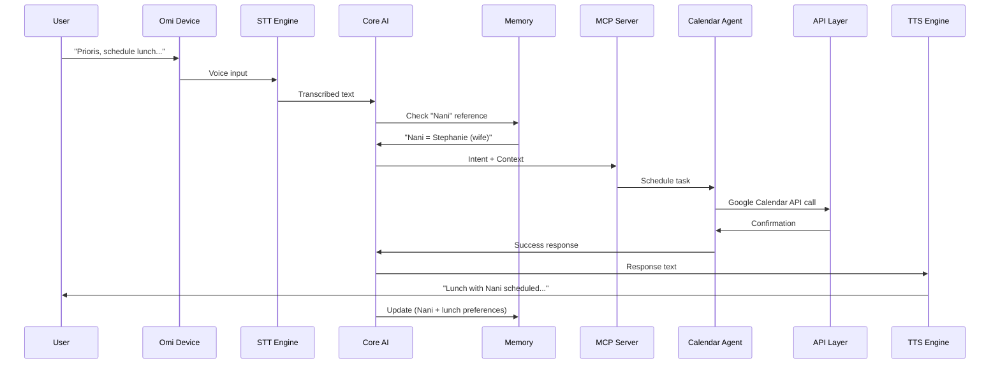
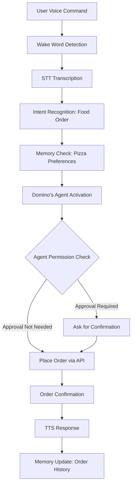
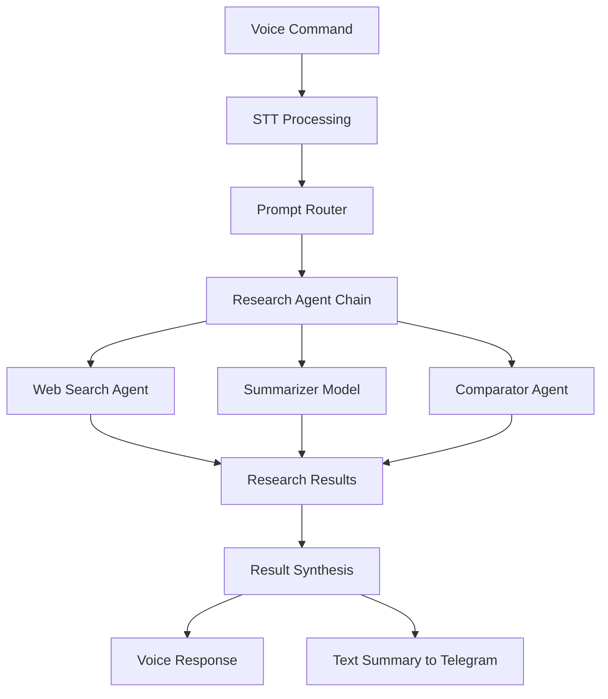
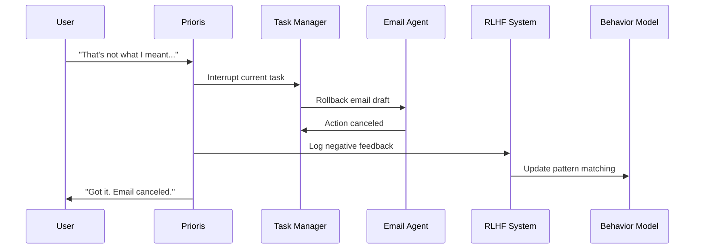

# Data Flows

## 🔄 Data Flow Examples

```
+------------------+         +------------------+          +------------------------+         +-----------------------+
|   Omi Device     |  --->   |  STT Engine      |  --->    |  Prioris Core AI       |  --->   |  Calendar Integration |
| (Wake Word Mic)  |         | (Whisper/Deepgram)|         | (Intent + Context)     |         | (Google/Outlook API)  |
+------------------+         +------------------+          +------------------------+         +-----------------------+
                                |                                |                                |
                                v                                v                                v
                        Transcribes speech            Analyzes intent + memory         Authenticates + schedules
                                                          ("Nani" → "Stephanie")        event via API call
                                |                                |                                |
                                v                                v                                v
                        +------------------+         +------------------------+         +-----------------------+
                        | TTS Engine       | <-------| Generates Response     |<--------| Confirms Event Status |
                        | (ElevenLabs)     |         | ("Lunch with Nani...") |         | (returns confirmation)|
                        +------------------+         +------------------------+         +-----------------------+
                                |
                                v
                        Speaks response aloud
```

### ✅ Example 1: Schedule an Event

Command: "Prioris, schedule lunch with Nani at 1pm tomorrow."



1. Omi device detects the wake word and activates listening.
2. Speech is transcribed to text using Whisper STT.
3. Core AI parses the intent (schedule a calendar event).
4. Memory check: Recognizes "Nani" as Stephanie (wife).
5. MCP session passes context into the task dispatcher.
6. Calendar Agent accesses Google Calendar via API:
   - Checks availability
   - Books the 1pm slot
7. Response generated → "Lunch with Nani at 1pm tomorrow has been scheduled."
8. ElevenLabs TTS speaks the response.
9. Memory updated to recall "Nani likes sushi for lunch" (if mentioned).

---

### ✅ Example 2: Order Food

Command: "Prioris, order two pepperoni pizzas from Domino's."



1. Wake word triggers listening → transcribed via STT.
2. Intent recognized as a food order.
3. Pizza preference confirmed from memory (last order or past correction).
4. Domino's Agent logs in via API or web automation (headless fallback).
5. Places order using saved address and payment method.
6. TTS response: "Order placed. ETA is 26 minutes."
7. Agent Permission config kicks in if payment approval is required.
8. Order history saved to local encrypted memory.

---

### ✅ Example 3: Deep Research Task

Command: "Prioris, compare the health benefits of intermittent fasting and keto."



1. Voice → STT → routed through Prompt Router.
2. Core AI invokes Research Agent Chain with:
   - Web search agent (SerpAPI or Hyperbolic)
   - Summarizer model (Claude or GPT-4)
   - Comparator agent (builds pros/cons list)
3. Each agent runs in parallel using the orchestrator.
4. Results synthesized into a simple summary:
   - "Here's the comparison in 3 key points…"
5. Output returned via voice + optional text summary to your Telegram.

---

### ✅ Example 4: Correcting Prioris (RLHF Feedback)

Command: "That's not what I meant — cancel the last email."



1. Wake word triggers interrupt path mid-task.
2. Prioris rolls back the latest email draft action.
3. Logs the correction as negative feedback.
4. Adjusts its future pattern matching (e.g., avoids sending before confirming recipients).
5. You hear: "Got it. Email canceled. I'll ask before sending next time."

---

### ✅ Example 5: Offline Use

Command: "Prioris, create a shopping list and remind me at 5."

```mermaid
flowchart LR
    A[Voice Command] --> B[Local Wake Word Detection]
    B --> C[Local STT via Whisper]
    C --> D[Local LLM via Ollama]
    D --> E[Task Parser]
    E --> F[Local Memory DB]
    F --> G[Timer System]
    G -->|At 5:00 PM| H[Reminder Trigger]
    H --> I[Local TTS Engine]
    I --> J[Voice Reminder]
```



1. Prioris is offline (e.g., no internet).
2. Wake word still works — STT runs locally via Whisper.
3. Command is parsed using Ollama's local LLM fallback.
4. Task saved to local memory DB with timestamped reminder.
5. At 5:00, Prioris triggers reminder and reads back the shopping list aloud. 